# Fina - Fraud Detection Chatbot Assistant

An AI-powered chatbot that combines transaction data analysis (Text-to-SQL) with fraud detection research documents (RAG) to provide comprehensive fraud insights.

## Table of Contents

- [Overview](#overview)
- [Architecture](#architecture)
- [Tech Stack](#tech-stack)
- [Database Schema](#database-schema)
- [Query Workflow](#query-workflow)
- [Project Structure](#project-structure)
- [Setup](#setup)
- [Usage](#usage)
- [API Reference](#api-reference)

## Overview

Fina answers fraud-related questions by leveraging two data sources:

1. **Transaction Database (SQL)** - Historical fraud transaction data from Kaggle dataset (~1.8M records)
2. **Research Documents (RAG)** - Fraud detection research papers indexed in Elasticsearch

The system uses LangGraph for orchestration, automatically routing queries to the appropriate data source based on LLM intent classification.

## Screenshots

Below are snapshots of the application (UI, API, and architecture):

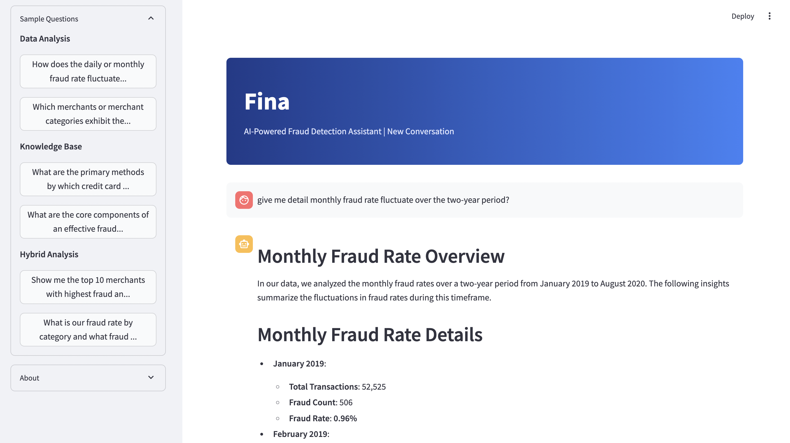
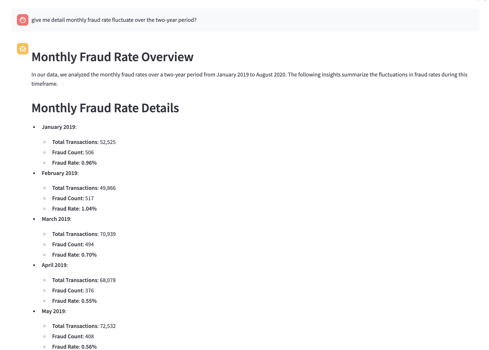
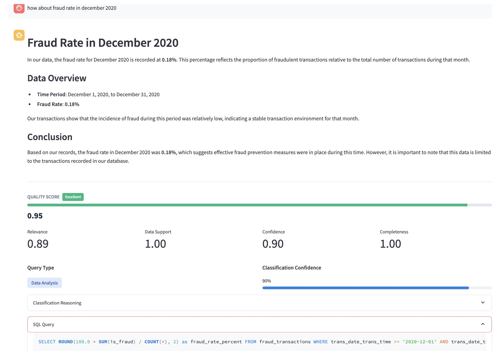
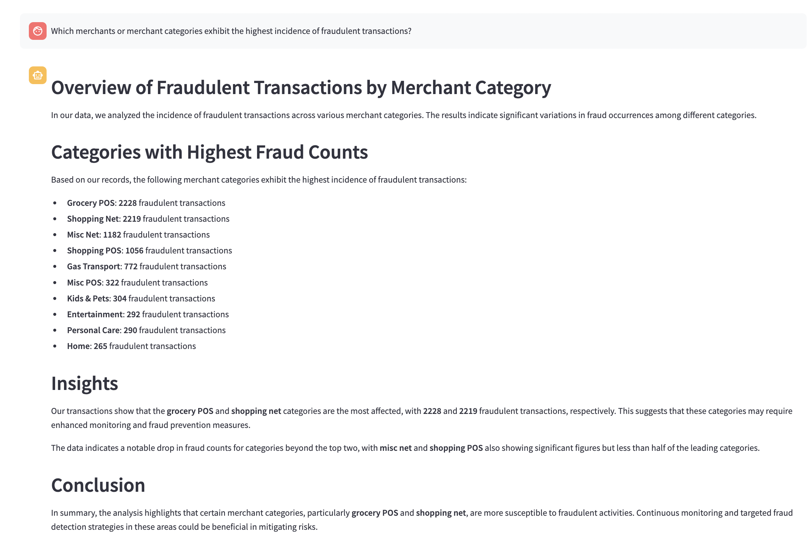
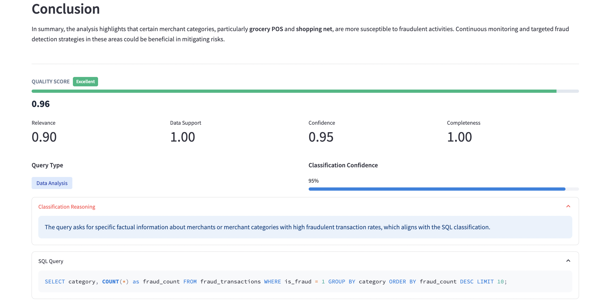
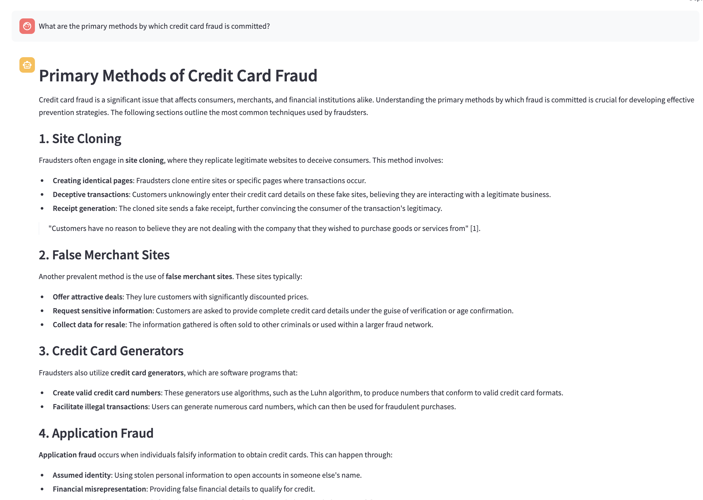
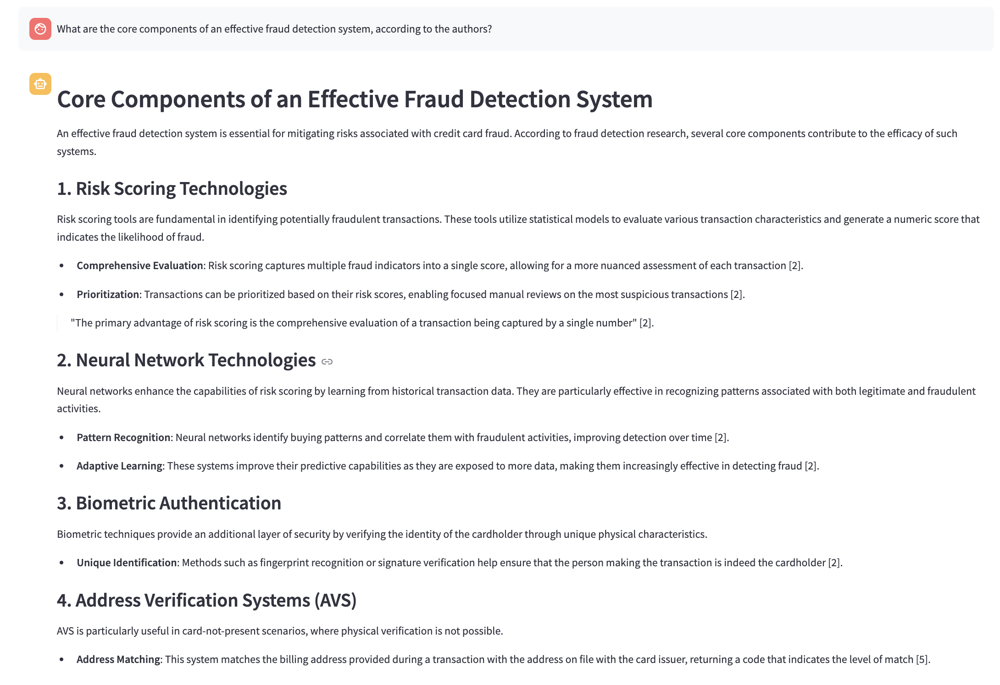
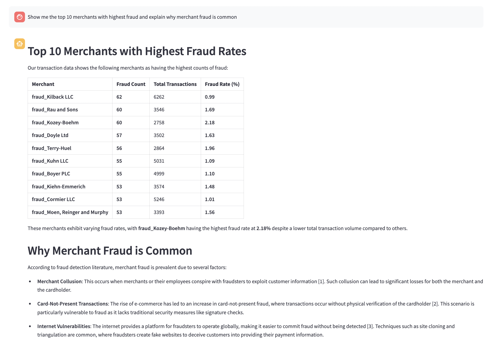
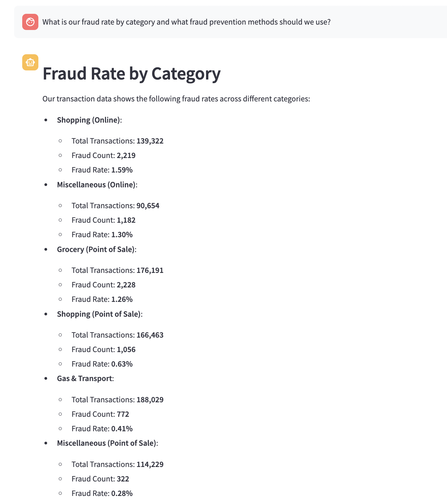

### Key Features

- LLM-based intent classification (not regex/keyword matching)
- Text-to-SQL with Vanna AI for natural language database queries
- Hybrid search (semantic + keyword) over research documents
- Multi-turn conversation with context awareness
- Real-time streaming responses
- Citation support with page numbers
- Quality scoring for each response

## Architecture

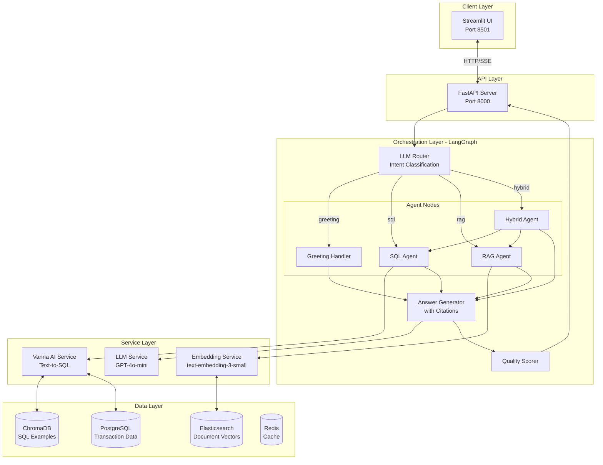

## Tech Stack

| Component | Technology | Purpose |
|-----------|------------|---------|
| Backend | FastAPI | Async REST API with SSE streaming |
| Orchestration | LangGraph | Stateful agent workflow |
| Text-to-SQL | Vanna AI + ChromaDB | Natural language to SQL |
| Vector Search | Elasticsearch 8.11 | Hybrid semantic + keyword search |
| Embeddings | text-embedding-3-small | 1536-dim document embeddings |
| LLM | GPT-4o-mini | Classification and generation |
| Database | PostgreSQL 15 | Transaction data (1.8M rows) |
| Cache | Redis 7 | Response caching |
| Frontend | Streamlit | Chat interface |
| Container | Docker Compose | Multi-service deployment |

## Database Schema

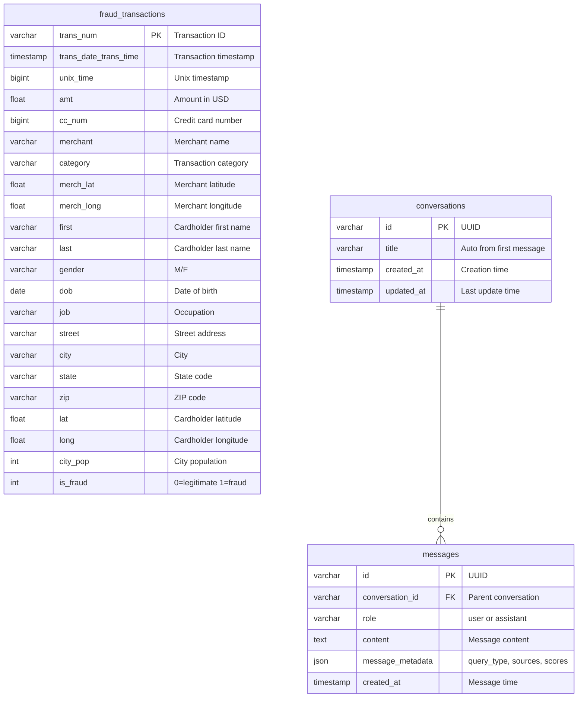

### Table Descriptions

| Table | Records | Purpose |
|-------|---------|---------|
| `fraud_transactions` | ~1.8M | Kaggle fraud detection dataset with transaction details and fraud labels |
| `conversations` | Dynamic | Chat session threads for multi-turn conversations |
| `messages` | Dynamic | User and assistant messages with metadata (query type, sources, quality score) |

## Query Workflow

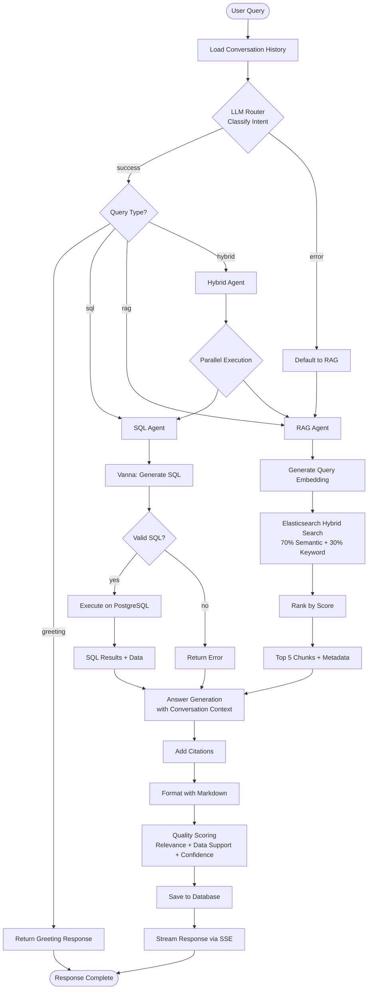

### Query Type Classification

| Type | Trigger | Data Source | Example |
|------|---------|-------------|---------|
| GREETING | Casual phrases | None | "Hello", "Thanks" |
| SQL | Data questions | PostgreSQL | "How many frauds last month?" |
| RAG | Theory questions | Elasticsearch | "What are fraud detection methods?" |
| HYBRID | Data + context | Both | "Show fraud trend and explain why" |

## Project Structure

```
fraud-detection-chatbot-assistant/
├── app/
│   ├── main.py                 # FastAPI app, lifespan, static files
│   ├── config.py               # Pydantic settings from .env
│   │
│   ├── agents/
│   │   ├── orchestrator.py     # LangGraph workflow definition
│   │   │                       # - Router node (LLM classification)
│   │   │                       # - SQL/RAG/Hybrid agent nodes
│   │   │                       # - Answer generation with citations
│   │   │                       # - Quality scoring
│   │   │                       # - Streaming support
│   │   └── state.py            # TypedDict state schema
│   │
│   ├── api/
│   │   └── chat.py             # REST endpoints
│   │                           # - POST /chat (stream/non-stream)
│   │                           # - GET /conversations
│   │                           # - DELETE /conversations/{id}
│   │                           # - GET /sample-questions
│   │
│   ├── db/
│   │   ├── models.py           # SQLAlchemy models
│   │   │                       # - FraudTransaction
│   │   │                       # - Conversation
│   │   │                       # - Message
│   │   └── session.py          # Async/sync engines and sessions
│   │
│   ├── services/
│   │   ├── vanna_service.py    # Vanna AI wrapper
│   │   │                       # - ChromaDB vector store
│   │   │                       # - Training data (DDL, docs, Q&A)
│   │   │                       # - SQL generation with introspection
│   │   ├── llm_service.py      # OpenAI chat completion
│   │   └── embedding_service.py # OpenAI embeddings
│   │
│   └── tools/
│       └── elasticsearch_tool.py # Hybrid search implementation
│                                 # - Cosine similarity (70% weight)
│                                 # - Keyword matching (30% weight)
│                                 # - Batch indexing
│
├── ui/
│   └── streamlit_app.py        # Chat interface
│                               # - Conversation sidebar
│                               # - Streaming display
│                               # - Citations with PDF links
│                               # - Sample questions
│
├── scripts/
│   ├── ingest_data.py          # Load CSV to PostgreSQL
│   │                           # - Schema creation
│   │                           # - Batch insert with progress
│   └── process_documents.py    # Index PDFs to Elasticsearch
│                               # - Page-aware chunking
│                               # - Embedding generation
│                               # - Metadata preservation
│
├── data/
│   ├── fraudTrain.csv          # Training dataset
│   ├── fraudTest.csv           # Test dataset
│   └── documents/              # PDF research papers
│       └── *.pdf
│
├── docker-compose.yml          # Service orchestration
├── Dockerfile                  # Python app image
├── requirements.txt            # Dependencies
├── .env.example                # Environment template
└── README.md
```

### Key Files

| File | Description |
|------|-------------|
| `orchestrator.py` | Core LangGraph workflow with all agent logic |
| `vanna_service.py` | Text-to-SQL with 13 training examples |
| `chat.py` | API endpoints with conversation management |
| `streamlit_app.py` | Full chat UI with streaming |
| `elasticsearch_tool.py` | Hybrid search implementation |

## Setup

### Prerequisites

- Docker and Docker Compose
- OpenAI API key
- 4GB+ RAM

### Quick Start

```bash
# 1. Clone repository
git clone <repo-url>
cd fraud-detection-chatbot-assistant

# 2. Configure environment
cp .env.example .env
# Edit .env and set OPENAI_API_KEY

# 3. Add data files
# Place in data/: fraudTrain.csv, fraudTest.csv
# Place in data/documents/: PDF files
# Dataset source (Kaggle): https://www.kaggle.com/datasets/kartik2112/fraud-detection/data?select=fraud%20dataset

# 4. Start all services
docker-compose up -d --build

# 5. Wait for services to be healthy
docker-compose ps

# 6. Ingest data (first time only)
docker-compose exec fastapi python scripts/ingest_data.py
docker-compose exec fastapi python scripts/process_documents.py

# 7. Access application
# UI: http://localhost:8501
# API: http://localhost:8000/docs
```

### Environment Variables

```bash
# Required
OPENAI_API_KEY=sk-...

# Models (defaults shown)
OPENAI_MODEL=gpt-4o-mini
OPENAI_EMBEDDING_MODEL=text-embedding-3-small

# Database
POSTGRES_HOST=postgres
POSTGRES_PORT=5432
POSTGRES_DB=fraud_detection
POSTGRES_USER=postgres
POSTGRES_PASSWORD=password

# Elasticsearch
ELASTICSEARCH_URL=http://elasticsearch:9200
ELASTICSEARCH_INDEX=fraud_documents

# Application
API_HOST=0.0.0.0
API_PORT=8000
DEBUG=false
LOG_LEVEL=INFO
```

## Usage

### Starting a Conversation

1. Open http://localhost:8501
2. Click "+ New Chat" in sidebar
3. Type a question or select from samples

### Example Queries

**SQL (Transaction Analysis)**
```
How many fraudulent transactions were there last month?
Which merchants have the highest fraud rate?
Show fraud trends by category
```

**RAG (Research/Theory)**
```
What are the primary methods of credit card fraud?
How does card-not-present fraud work?
What are the components of a fraud detection system?
```

**Hybrid (Data + Context)**
```
Show our monthly fraud rate and explain if it's normal
Which categories have high fraud and why are they vulnerable?
Compare our fraud patterns with industry research
```

### Multi-turn Conversation

The system maintains context across messages:

```
User: Which merchants have the highest fraud rate?
Fina: Top 5 merchants by fraud rate: 1) fraud_Smith LLC (8.2%)...

User: Tell me more about the first one
Fina: [Understands "first one" = fraud_Smith LLC]
      fraud_Smith LLC has 2,134 total transactions...

User: Why might their rate be so high?
Fina: [Combines SQL data with RAG research]
      According to research, merchant fraud rates can be elevated due to...
```

## API Reference

### POST /api/chat

Send a message to the chatbot.

**Request:**
```json
{
  "query": "How many fraud transactions last month?",
  "conversation_id": "uuid-optional",
  "stream": true
}
```

**Response (stream=false):**
```json
{
  "answer": "Based on our transaction data...",
  "quality_score": {
    "relevance": 0.92,
    "data_support": 1.0,
    "confidence": 0.85,
    "completeness": 0.95,
    "overall": 0.93
  },
  "query_type": "sql",
  "classification_confidence": 0.9,
  "sql_query": "SELECT COUNT(*) FROM fraud_transactions WHERE...",
  "sources": [],
  "error": null
}
```

**Response (stream=true):**

Server-Sent Events with types:
- `start` - Query received
- `classification` - Intent classified
- `progress` - Agent status update
- `sql_result` - SQL query and row count
- `rag_result` - Retrieved chunks and sources
- `answer_chunk` - Streamed answer text
- `quality_score` - Final scores
- `done` - Completion with metadata

### GET /api/conversations

List recent conversations (max 50).

```json
[
  {
    "id": "uuid",
    "title": "How many fraud transactions...",
    "created_at": "2024-01-17T12:00:00Z",
    "updated_at": "2024-01-17T12:05:00Z",
    "message_count": 4
  }
]
```

### DELETE /api/conversations/{id}

Delete a conversation and all messages.

### GET /api/sample-questions

Get categorized sample questions.

```json
[
  {"question": "How many fraudulent transactions?", "type": "sql"},
  {"question": "What are fraud detection methods?", "type": "rag"},
  {"question": "Show fraud trend and explain", "type": "hybrid"}
]
```

## Quality Scoring

Each response is scored on four dimensions:

| Metric | Weight | Calculation |
|--------|--------|-------------|
| Relevance | 30% | Cosine similarity between query and answer embeddings |
| Data Support | 30% | Presence of SQL results or RAG chunks |
| Confidence | 20% | Router classification confidence |
| Completeness | 20% | Answer length and citation presence |

Overall score = weighted average (0.0 - 1.0 scale)

## Development

### Adding Vanna Training Data

Edit `app/services/vanna_service.py`:

```python
SAMPLE_QUERIES_TRAINING = [
    {
        "question": "Your question here",
        "sql": "SELECT ... FROM fraud_transactions WHERE ..."
    }
]
```

Restart FastAPI to retrain.

### Adding Documents

```bash
# Place PDF in data/documents/
cp new_paper.pdf data/documents/

# Re-index (inside container)
docker-compose exec fastapi python scripts/process_documents.py
```

### Viewing Logs

```bash
# All services
docker-compose logs -f

# Specific service
docker-compose logs -f fastapi
docker-compose logs -f streamlit

# With timestamps
docker-compose logs -f -t fastapi
```

---

Built with FastAPI, LangGraph, Vanna AI, Elasticsearch, and Streamlit.
